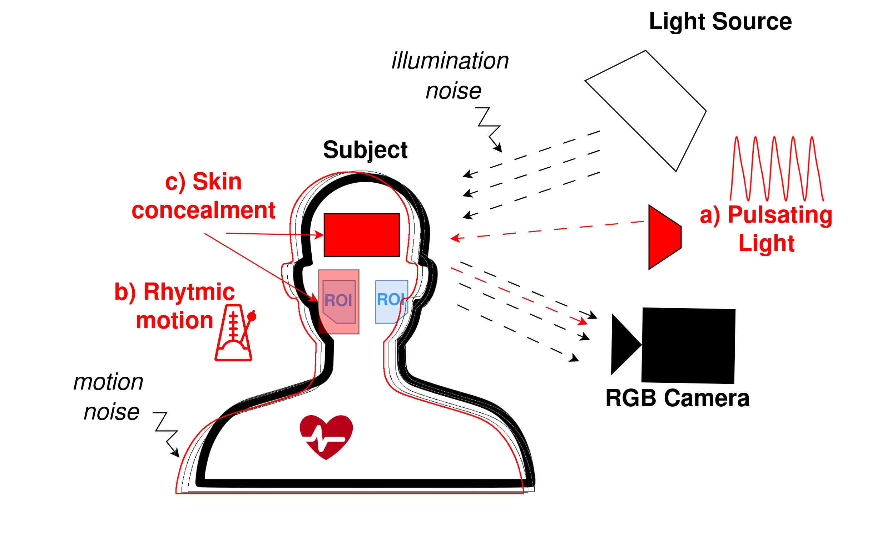

# ORPDAD
This is the official code repository of our dataset and ECCV 2024 paper entitled "Oulu Remote-photoplethysmography Physical Domain Attacks Database (OPDAD)". 

In this study we propose the first dataset containing a wide set of physical domain attack scenarios divided in three categories (illumination, movement, concealment) that directly target the main weaknesses of rPPG. As rPPG can be easily influenced by the recording environment, this vulnerability can therefore be exploited to inject fake signals or impair predictions physically. ORPDAD was collected as a new benchmark dataset to evaluate the robustness of rPPG to Physical Domain Attacks. In our paper we analyse a total of 13 rPPG methods (6 hand-crafted + 7 deep learning) and their susceptibility to the proposed attack scenarios. We hope that our dataset can encourage further research in security to physical attacks and that it will aid the development of new more robust methods. 

You can check our paper on the following link ([https://link.springer.com/chapter/10.1007/978-3-031-73464-9_4](https://link.springer.com/chapter/10.1007/978-3-031-73464-9_4)). In this repository you will find all the necessary code to run baseline methods on the pre-processed data, and also the pre-processing code. Due to strict regulations governing the use of sensitive data we cannot publish it directly, if you want to utilize our dataset for academic purposes please contact guoying.zhao@oulu.fi to request a copy.

The shared data may be used only in strict accordance with a mutually signed Data Transfer Agreement, which terms dictate the usage of the data (academic, non-commercial, non-distributable). For publications, not all subjects have given consent for their images to be used in graphics. Only images from subject IDs **001-017, 019-022, 025-030** may be used in publications. It is prohibited to use sample images from IDs 018, 023, 024.

# Physical Domain Attacks in RPPG

As rPPG is an emerging technology that deals with sensitive data and could be employed in applications where security is critical (clinical, remote driver monitoring, anti-spoofing, authentication, \etc), it is crucial to critically assess its vulnerabilities early and work towards mitigating potential security exploits. This dataset focuses on the scarcely studied physical-domain attacks. A physical-domain attack assumes that the attacker cannot influence the digital data after acquisition or the rPPG method used for estimation, namely the attacker can only inject noise during the acquisition process using physical means. We study three major vulnerabilities and attack scenario categories. Firstly, as rPPG is measured from reflected light, a possible attack vector is the light source. Adding a weak perturbation signal to the incident light source means that it will be present in the estimated rPPG signal as well. Secondly, subject movement induces noise to the extracted signal, consequently having the subject move at a set rhythm will make this added motion perturbation strongly periodical. Therefore, we can leverage both motion and illumination to inject strongly periodical (rPPG like) signals into the data. Thirdly, the light measured is reflected from the skin, so either blocking the light (with an opaque cloth) or attenuating it (with make-up) can affect the rPPG negatively. Consequently we define these three physical-domain attack  categories: **Illumination (I)**, **Movement (M)** and **Concealment (C)**.


# What does ORPDAD contain

We record data from **30 participants** ( with no history of heart disease) under different scenarios based on the three aforementioned categories of attacks. We record **70 second** videos for each scenario, for a total of **26 scenarios** per subject, resulting in **780 videos** equivalent to ≈**15.2h** of footage. For the synchronised ground truth physiological signals we record both PPG waveforms via a finger-oximeter and ECG waveforms via an ECG device. Based on the defined attack categories, we define the following scenarios:

* **Still (S1-S3)**: Subject is recorded at a still and resting state before each attack category. Motion is kept at a comfortable minimum.

* **Illumination (I1-I6)**: We combine the two attack frequencies (50bpm, 100bpm) and three different intensity settings (S=7\%, M=14\% and L=21\% of the attack device max brightness), resulting in I1=50S, I2=50M, I3=50L, I4=100S, I5=100M, I6=100L. The intensities are much weaker than the base lighting, and cause perturbations are visually imperceptible in the recordings.

* **Movement (M1-M11)**: We explore simple movements such as small vertical (SV), large vertical (LV), small horizontal (SH), large horizontal (LH), mouth open/close (M) at the two target frequencies (50bpm, 100bpm). Resulting in M1=50SV, M2=50LV, M3=50SH, M4=50LH,  M5=50M, M6=100SV, M7=100LV, M8=100SH, M9=100LH,  M10=100M. We also include natural talking motion M11 that is not at a set attack frequency.

* **Concealment (C1-C6)**: The first three opaque (C1-C3) scenarios involve wearing a forehead concealing beanie C1, a facial mask C2 and then both C3. The transparent concealment scenarios (C4-C6) contain progressive application of make-up with primer C4, foundation C5 and setting powder C6.


For each recording we provide:
- 1920x1080p 30fps RGB video
- synchronised groundtruth from both PPG and ECG devices
- 128x128 cropped videos centered at the face (for end-to-end methods)
- 68 point facial landmarks for each frame
- spatial-temporal map representations for each video (for non-end-to-end methods)
We also provide the trained models and code used to establish the baselines from our paper

# How ORPDAD was collected
To study each attack vector in an isolated manner, we setup a controlled recording environment as to minimise the influence of external factors that are not related to the attack. Thus, we keep the same base environment for all subjects and scenarios, enabling us to study the specific contribution induced by the attacks. For the base video recordings we use a professional RGB camera and two fixed led lights. We record the physiological signals with a finger PPG oximeter and a portable ECG belt device. All the recording devices are synchronised by keeping internal clock times consistent. The subjects are seated at ≈1m from the camera and the lights are positioned above the camera and illuminate the subject at a 45° angle at ≈1.5m distance. 

For the illumination attacks we design two modulated light panels that each operate at 1600 lm maximum, by using led strips and a control circuit. These panels allow the injected light signal to be more uniformly distributed over the face surface instead of attacking only part of it (single led case). We pilot the panels with Pulse Width Modulation (PWM) signals, thus being able to create a light source that can output any waveform and at any fraction of the max intensity. For this experiment we simulate a typical rPPG waveform, with the main frequency component placed at the target frequency and a second harmonic at 1/4 of the peak intensity. For the L, M, H settings we use 7%, 14%, 21% of the max power and set the lights at ≈1m distance from the subject. For the movement scenarios we simply utilise an audio metronome and instruct the subjects to move according to the set rhythm and movement type. For opaque concealment we use medical face masks and black beanie hats. For translucent concealment we choose a primer, foundation and setting powder, and keep the brand and shade (220 natural beige) consistent among all subjects. 


# Dataset Structure
The dataset contains RGB videos, time aligned PPG and ECG waveforms, face center cropped videos, spatial-temporal maps and facial landmarks. It also containts baseline models trained on the data.
```
ORPDAD_RGB_videos_partX.zip #divided in X = 1,..., 10 parts for smaller size download files
├── 0XX # participants ID goes from 001 to 030
│   └── video
│       ├──  SCEN.mov # ≈70s(≈2100frames) RGB video at 1920x1080 30fps
│       └──  ..... # same for each of the 26 SCEN -> S1-S3, I1-I6, M1-M11, C1-C6
ORPDAD_DATA.zip #contains all the processed data and ground truth (cropped videos, bvp and ecg, spatial-temporal maps, landmarks )
├── 0XX # participants ID goes from 001 to 030
│   ├── blockh5
│   │   ├──  SCEN_block128.h5 # SCEN_block128.h5["video"] is a  HDF5 wrapper for the numpy array containing the cropped video [T≈2100, H=128, W=128, C=3]
│   │   └──  ..... # same for each of the 26 SCEN -> S1-S3, I1-I6, M1-M11, C1-C6
│   ├── maps
│   │   ├──  SCEN_mstmap.npy  # MSTmap of [R=63, T≈2100, C=3] calculate using Niu, X. et al. "Video-based remote physiological measurement via cross-verified feature disentangling." Computer Vision–ECCV 2020
│   │   ├──  SCEN_stmap.npy # Spatial-temporal map similar to MSTmap, but only containing signals from the 6 ROIs and their union, without all the other ROI combinations. [R=7, T≈2100, C=3]
│   │   └──  ..... # same for each of the 26 SCEN -> S1-S3, I1-I6, M1-M11, C1-C6
│   ├── ecg
│   │   ├──  SCEN_ecg.npy # 1000Hz ECG signal [T_ecg≈70000]
│   │   ├──  SCEN_pseudobvp.npy # 30Hz BVP signal derived from ECG [T≈2100], used for all experiments as it is more accurate than the signal obtain from the finger PPG
│   │   └──  ..... # same for each of the 26 SCEN -> S1-S3, I1-I6, M1-M11, C1-C6
│   ├── bvp
│   │   ├──  SCEN_bvp.npy # 30Hz BVP signal derived from PPG [T≈2100], less accurate than ECG derived BVP
│   │   ├──  SCEN_hr.npy # 1Hz HR calculated for each second by the PPG device [T_hr≈70]
│   │   └──  ..... # same for each of the 26 SCEN -> S1-S3, I1-I6, M1-M11, C1-C6
│   └── lnd
│       ├──  SCEN_lnd.npy 68 point facial landmark coordinates calculated using PyFeat [T≈2100, L=68, XY=2]
│       └──  ..... # same for each of the 26 SCEN -> S1-S3, I1-I6, M1-M11, C1-C6
ORPDAD_TRAINED_MODELS.zip #contains all the trained .pth models
└──  records
    └──  model #contains .pth trained models for each evaluted DL method for all 5 folds in still(AU) -> S1-S3, all50(AA 50bpm) -> S(S1-S3),I-50bpm(I1-I3),M-50bpm(M1-M5 and M11), C(C1-C6) and all100 (AA 100bpm) -> S(S1-S3),I-100bpm(I4-I6),M-100bpm(M6-M10 and M11), C(C1-C6)
```

# Evaluation Protocols 
In testing 30 second non-overlapping segments are evaluated, and we calculate the HR by finding the highest PSD peak. For example from a 70s recording we calculate the HR for 2 segments that go from 5s to 35s and 35s to 65s.
To ensure fair validation we adopt a 5-fold subject exclusive protocol for all experiments. E.g. Fold1 test: 001-005 train: 006-030, Fold2 test: 006-010 train: 001-005 and 011-030, ...
For Deep Learning Methods two different training conditions:
- Attack Unaware (AU), Training set includes only (S1-S3)
- Attack Aware (AA), Training set includes all scenarios (S1-S3, I1-I6, M1-M11, C1-C6)
In addition for the AA protocol, to keep the specific attack frequency hidden from the networks we adopt an attack frequency cross validation (naturally while still doing 5-fold subject exclusive validation as well). As the attack frequencies are fixed, supervised methods could easily cheat by learning to not predict the seen specific attack frequency, without learning any useful features from the attacks. <br>
In practice we keep the frequencies separate in the training and testing set, only keeping the non-frequency specific scenarios in common (S1-S3,M11,C1-C6):<br>
- Cross-freq1: Train on S(S1-S3),I-50bpm(I1-I3),M-50bpm(M1-M5 and M11), C(C1-C6) <br>
- Cross-freq1: Test on S(S1-S3),I-100bpm(I4-I6),M-100bpm(M6-M10 and M11), C(C1-C6)  <br>
- Cross-freq2: Train on S(S1-S3),I-100bpm(I4-I6),M-100bpm(M6-M10 and M11), C(C1-C6) <br>
- Cross-freq2: Test on S(S1-S3),I-50bpm(I1-I3),M-50bpm(M1-M5 and M11), C(C1-C6)  <br>
Finally, for the the non-frequnecy specific scenarios S1-S3, M11, C1-C6 we average over both, for the frequency specific ones take only the cross-frequency validated outputs.

# Training/Evaluation code
In the training_testing_code directory is all the code needed to run the baseline methods. *MSTmap_loader.py* is the dataloader for non-end-to-end methods using MSTmaps, for end-to-end we use *deepphys_block_loader.py* for DeepPhys and TS-CAN, and *block_loader.py* for all others. The 3 provided .sh files contain example of how the provided scripts are used. To train, test and calculate metrics you can use *example_cvd_train_eval.sh* for non-end-to-end methods (just change cvd with another method). For end-to-end *example_physnet_train_eval.sh* is an example (for other methods just change method name from physnet to desired one). Finally, for hand-crafted methods just run *eval_trad.sh*. 

# Pre-processing code

The shared dataset includes face centered cropped videos, mstmaps and landmarks. However, we also provide code for obtaining the pre-processed data from the raw RGB videos. Firstly, *calc_landmarks_pyfeat.py* is used to calculate 68-point landmarks for each video frame. Secondly, for end-to-end methods input *crop_faces_128_h5.py* takes the raw RGB videos and landmarks and crops and resizes the videos to be 128x128 and face centered. Finally, for non-end-to-end methods, *mstmap_hist_roi.py* can be used to compute the multi-scale spatial temporal maps from the raw RGB videos, by defining ROIs based on the facial landmarks.
 
